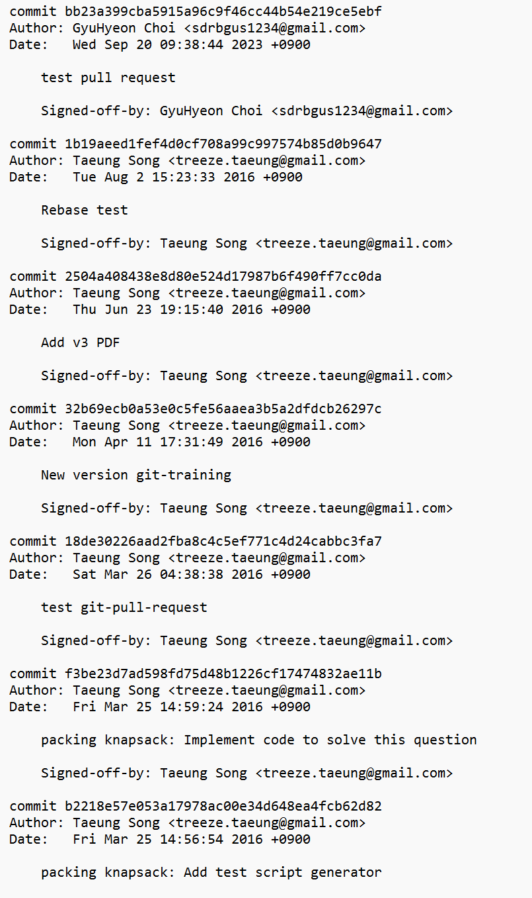

# # **오픈소스SW개발론**

### Introduction

---

### Week1-1 강의 개요 (강의계획서)

- Octoverse(oss부분 ptt제작)
- oss라이센스

---

### Week1-2 오픈소스소프트웨어 개요

- _os의 개념_
- **라이센스**  
  GPL  
  LGPL  
  MPL  
  BSD

---

### Week2-1 버전 관리 개요

- VCS  
  CVS  
  SVN  
  Mercurial  
  Darcs  
  Git

- Git 작동 원리  
  add  
  commit  
  push  
  merge
  fork  
  pull request

---

### Week2-2 Git

- Git의 기능

- Git 실습
  - git cd(디렉토리 접근)
  - git copy(파일 복사)
  - git add(커밋할 목록에 추가)
  - commit(커밋)
  - git status(상태 확인)
  - git diff(달라진 점 확인)
  - git log(지금까지 작업한 내용)
  - git shortlog(log 짧은 버전)
  - git remote add origin **URL**(원격저장소 등록)
  - git push origin master(origin에 밀어넣기)

---

### Week2-3 Github, fork, pull request

- fork
  > fork를 하되 본인 프로젝트 대상으로 하는 것이 아님(pull request하고자 하는 대상의 깃허브에서 fork버튼 클릭)
- branch, add, commit, push
  > clone(fork한 repo에서 복사한 URL) -> git checkout -b develop -> add -> commit -> push
- pull request
  > 1. 나의 프로필에서 fork 해서 만들어진 프로젝트 페이지에서 branch 클릭 -> New pull-request
  > 2. github에서 fork한 저장소에서 pull-request 클릭

[My Github Blog](https://github.com/G100/oss_git_example)

---

### Week3 Markdown

- **bold**
- _italic_
- https://www.markdowntutorial.com
